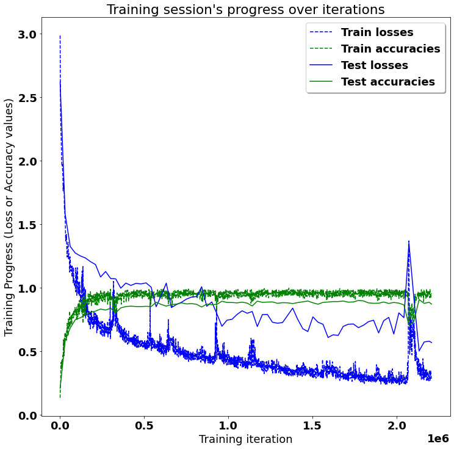
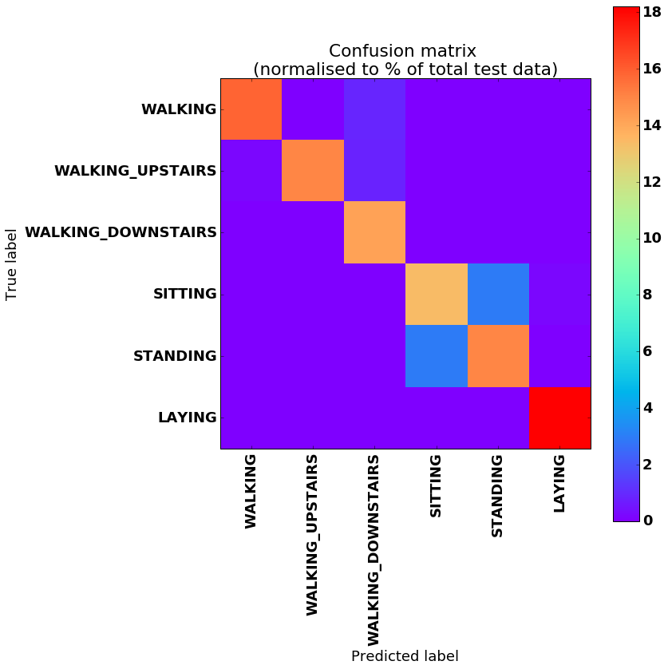

# <a title="Activity Recognition" href="https://github.com/guillaume-chevalier/LSTM-Human-Activity-Recognition" > LSTMs for Human Activity Recognition</a>

Human Activity Recognition (HAR) using smartphones dataset and an LSTM RNN. Classifying the type of movement amongst six categories:
- WALKING,
- WALKING_UPSTAIRS,
- WALKING_DOWNSTAIRS,
- SITTING,
- STANDING,
- LAYING.

Compared to a classical approach, using a Recurrent Neural Networks (RNN) with Long Short-Term Memory cells (LSTMs) require no or almost no feature engineering. Data can be fed directly into the neural network who acts like a black box, modeling the problem correctly. [Other research](https://archive.ics.uci.edu/ml/machine-learning-databases/00240/UCI%20HAR%20Dataset.names) on the activity recognition dataset can use a big amount of feature engineering, which is rather a signal processing approach combined with classical data science techniques. The approach here is rather very simple in terms of how much was the data preprocessed. 

Let's use Google's neat Deep Learning library, TensorFlow, demonstrating the usage of an LSTM, a type of Artificial Neural Network that can process sequential data / time series. 

## Video dataset overview

Follow this link to see a video of the 6 activities recorded in the experiment with one of the participants:

<p align="center">
  <a href="http://www.youtube.com/watch?feature=player_embedded&v=XOEN9W05_4A
" target="_blank"></a>
  <a href="https://youtu.be/XOEN9W05_4A"><center>[Watch video]</center></a>
</p>

## Details about the input data

I will be using an LSTM on the data to learn (as a cellphone attached on the waist) to recognise the type of activity that the user is doing. The dataset's description goes like this:

> The sensor signals (accelerometer and gyroscope) were pre-processed by applying noise filters and then sampled in fixed-width sliding windows of 2.56 sec and 50% overlap (128 readings/window). The sensor acceleration signal, which has gravitational and body motion components, was separated using a Butterworth low-pass filter into body acceleration and gravity. The gravitational force is assumed to have only low frequency components, therefore a filter with 0.3 Hz cutoff frequency was used. 

That said, I will use the almost raw data: only the gravity effect has been filtered out of the accelerometer  as a preprocessing step for another 3D feature as an input to help learning. If you'd ever want to extract the gravity by yourself, you could fork my code on using a [Butterworth Low-Pass Filter (LPF) in Python](https://github.com/guillaume-chevalier/filtering-stft-and-laplace-transform) and edit it to have the right cutoff frequency of 0.3 Hz which is a good frequency for activity recognition from body sensors.

## What is an RNN?

As explained in [this article](http://karpathy.github.io/2015/05/21/rnn-effectiveness/), an RNN takes many input vectors to process them and output other vectors. It can be roughly pictured like in the image below, imagining each rectangle has a vectorial depth and other special hidden quirks in the image below. **In our case, the "many to one" architecture is used**: we accept time series of [feature vectors](https://www.quora.com/What-do-samples-features-time-steps-mean-in-LSTM/answer/Guillaume-Chevalier-2) (one vector per [time step](https://www.quora.com/What-do-samples-features-time-steps-mean-in-LSTM/answer/Guillaume-Chevalier-2)) to convert them to a probability vector at the output for classification. Note that a "one to one" architecture would be a standard feedforward neural network. 

> <a href="http://karpathy.github.io/2015/05/21/rnn-effectiveness/" ></a>
> http://karpathy.github.io/2015/05/21/rnn-effectiveness/

## What is an LSTM?

An LSTM is an improved RNN. It is more complex, but easier to train, avoiding what is called the vanishing gradient problem. I recommend [this article](http://colah.github.io/posts/2015-08-Understanding-LSTMs/) for you to learn more on LSTMs.


## Results 

Scroll on! Nice visuals awaits. 


```python
# All Includes

import numpy as np
import matplotlib
import matplotlib.pyplot as plt
import tensorflow as tf  # Version 1.0.0 (some previous versions are used in past commits)
from sklearn import metrics

import os
```

    c:\users\sandeep\appdata\local\programs\python\python36\lib\site-packages\tensorflow\python\framework\dtypes.py:458: FutureWarning: Passing (type, 1) or '1type' as a synonym of type is deprecated; in a future version of numpy, it will be understood as (type, (1,)) / '(1,)type'.
      _np_qint8 = np.dtype([("qint8", np.int8, 1)])
    c:\users\sandeep\appdata\local\programs\python\python36\lib\site-packages\tensorflow\python\framework\dtypes.py:459: FutureWarning: Passing (type, 1) or '1type' as a synonym of type is deprecated; in a future version of numpy, it will be understood as (type, (1,)) / '(1,)type'.
      _np_quint8 = np.dtype([("quint8", np.uint8, 1)])
    c:\users\sandeep\appdata\local\programs\python\python36\lib\site-packages\tensorflow\python\framework\dtypes.py:460: FutureWarning: Passing (type, 1) or '1type' as a synonym of type is deprecated; in a future version of numpy, it will be understood as (type, (1,)) / '(1,)type'.
      _np_qint16 = np.dtype([("qint16", np.int16, 1)])
    c:\users\sandeep\appdata\local\programs\python\python36\lib\site-packages\tensorflow\python\framework\dtypes.py:461: FutureWarning: Passing (type, 1) or '1type' as a synonym of type is deprecated; in a future version of numpy, it will be understood as (type, (1,)) / '(1,)type'.
      _np_quint16 = np.dtype([("quint16", np.uint16, 1)])
    c:\users\sandeep\appdata\local\programs\python\python36\lib\site-packages\tensorflow\python\framework\dtypes.py:462: FutureWarning: Passing (type, 1) or '1type' as a synonym of type is deprecated; in a future version of numpy, it will be understood as (type, (1,)) / '(1,)type'.
      _np_qint32 = np.dtype([("qint32", np.int32, 1)])
    c:\users\sandeep\appdata\local\programs\python\python36\lib\site-packages\tensorflow\python\framework\dtypes.py:465: FutureWarning: Passing (type, 1) or '1type' as a synonym of type is deprecated; in a future version of numpy, it will be understood as (type, (1,)) / '(1,)type'.
      np_resource = np.dtype([("resource", np.ubyte, 1)])
    


```python
# Useful Constants

# Those are separate normalised input features for the neural network
INPUT_SIGNAL_TYPES = [
    "body_acc_x_",
    "body_acc_y_",
    "body_acc_z_",
    "body_gyro_x_",
    "body_gyro_y_",
    "body_gyro_z_",
    "total_acc_x_",
    "total_acc_y_",
    "total_acc_z_"
]

# Output classes to learn how to classify
LABELS = [
    "WALKING", 
    "WALKING_UPSTAIRS", 
    "WALKING_DOWNSTAIRS", 
    "SITTING", 
    "STANDING", 
    "LAYING"
] 

```

## Let's start by downloading the data: 


```python
# Note: Linux bash commands start with a "!" inside those "ipython notebook" cells

DATA_PATH = "data/"

!pwd && ls
os.chdir(DATA_PATH)
!pwd && ls

!python download_dataset.py

!pwd && ls
os.chdir("..")
!pwd && ls

DATASET_PATH = DATA_PATH + "UCI HAR Dataset/"
print("\n" + "Dataset is now located at: " + DATASET_PATH)

```

    'pwd' is not recognized as an internal or external command,
    operable program or batch file.
    'pwd' is not recognized as an internal or external command,
    operable program or batch file.
    

    
    Downloading...
    Downloading done.
    
    Extracting...
    Dataset already extracted. Did not extract twice.
    
    

    'wget' is not recognized as an internal or external command,
    operable program or batch file.
    'pwd' is not recognized as an internal or external command,
    operable program or batch file.
    

    
    Dataset is now located at: data/UCI HAR Dataset/
    

    'pwd' is not recognized as an internal or external command,
    operable program or batch file.
    

## Preparing dataset:


```python
TRAIN = "train/"
TEST = "test/"


# Load "X" (the neural network's training and testing inputs)

def load_X(X_signals_paths):
    X_signals = []
    
    for signal_type_path in X_signals_paths:
        file = open(signal_type_path, 'r')
        # Read dataset from disk, dealing with text files' syntax
        X_signals.append(
            [np.array(serie, dtype=np.float32) for serie in [
                row.replace('  ', ' ').strip().split(' ') for row in file
            ]]
        )
        file.close()
    
    return np.transpose(np.array(X_signals), (1, 2, 0))

X_train_signals_paths = [
    DATASET_PATH + TRAIN + "Inertial Signals/" + signal + "train.txt" for signal in INPUT_SIGNAL_TYPES
]
X_test_signals_paths = [
    DATASET_PATH + TEST + "Inertial Signals/" + signal + "test.txt" for signal in INPUT_SIGNAL_TYPES
]

X_train = load_X(X_train_signals_paths)
X_test = load_X(X_test_signals_paths)


# Load "y" (the neural network's training and testing outputs)

def load_y(y_path):
    file = open(y_path, 'r')
    # Read dataset from disk, dealing with text file's syntax
    y_ = np.array(
        [elem for elem in [
            row.replace('  ', ' ').strip().split(' ') for row in file
        ]], 
        dtype=np.int32
    )
    file.close()
    
    # Substract 1 to each output class for friendly 0-based indexing 
    return y_ - 1

y_train_path = DATASET_PATH + TRAIN + "y_train.txt"
y_test_path = DATASET_PATH + TEST + "y_test.txt"

y_train = load_y(y_train_path)
y_test = load_y(y_test_path)

```

## Additionnal Parameters:

Here are some core parameter definitions for the training. 

For example, the whole neural network's structure could be summarised by enumerating those parameters and the fact that two LSTM are used one on top of another (stacked) output-to-input as hidden layers through time steps. 


```python
# Input Data 

training_data_count = len(X_train)  # 7352 training series (with 50% overlap between each serie)
test_data_count = len(X_test)  # 2947 testing series
n_steps = len(X_train[0])  # 128 timesteps per series
n_input = len(X_train[0][0])  # 9 input parameters per timestep


# LSTM Neural Network's internal structure

n_hidden = 32 # Hidden layer num of features
n_classes = 6 # Total classes (should go up, or should go down)


# Training 

learning_rate = 0.0025
lambda_loss_amount = 0.0015
training_iters = training_data_count * 300  # Loop 300 times on the dataset
batch_size = 1500
display_iter = 30000  # To show test set accuracy during training


# Some debugging info

print("Some useful info to get an insight on dataset's shape and normalisation:")
print("(X shape, y shape, every X's mean, every X's standard deviation)")
print(X_test.shape, y_test.shape, np.mean(X_test), np.std(X_test))
print("The dataset is therefore properly normalised, as expected, but not yet one-hot encoded.")

```

    Some useful info to get an insight on dataset's shape and normalisation:
    (X shape, y shape, every X's mean, every X's standard deviation)
    (2947, 128, 9) (2947, 1) 0.09913992 0.39567086
    The dataset is therefore properly normalised, as expected, but not yet one-hot encoded.
    

## Utility functions for training:


```python
def LSTM_RNN(_X, _weights, _biases):
    # Function returns a tensorflow LSTM (RNN) artificial neural network from given parameters. 
    # Moreover, two LSTM cells are stacked which adds deepness to the neural network. 
    # Note, some code of this notebook is inspired from an slightly different 
    # RNN architecture used on another dataset, some of the credits goes to 
    # "aymericdamien" under the MIT license.

    # (NOTE: This step could be greatly optimised by shaping the dataset once
    # input shape: (batch_size, n_steps, n_input)
    _X = tf.transpose(_X, [1, 0, 2])  # permute n_steps and batch_size
    # Reshape to prepare input to hidden activation
    _X = tf.reshape(_X, [-1, n_input]) 
    # new shape: (n_steps*batch_size, n_input)
    
    # ReLU activation, thanks to Yu Zhao for adding this improvement here:
    _X = tf.nn.relu(tf.matmul(_X, _weights['hidden']) + _biases['hidden'])
    # Split data because rnn cell needs a list of inputs for the RNN inner loop
    _X = tf.split(_X, n_steps, 0) 
    # new shape: n_steps * (batch_size, n_hidden)

    # Define two stacked LSTM cells (two recurrent layers deep) with tensorflow
    lstm_cell_1 = tf.contrib.rnn.BasicLSTMCell(n_hidden, forget_bias=1.0, state_is_tuple=True)
    lstm_cell_2 = tf.contrib.rnn.BasicLSTMCell(n_hidden, forget_bias=1.0, state_is_tuple=True)
    lstm_cells = tf.contrib.rnn.MultiRNNCell([lstm_cell_1, lstm_cell_2], state_is_tuple=True)
    # Get LSTM cell output
    outputs, states = tf.contrib.rnn.static_rnn(lstm_cells, _X, dtype=tf.float32)

    # Get last time step's output feature for a "many-to-one" style classifier, 
    # as in the image describing RNNs at the top of this page
    lstm_last_output = outputs[-1]
    
    # Linear activation
    return tf.matmul(lstm_last_output, _weights['out']) + _biases['out']


def extract_batch_size(_train, step, batch_size):
    # Function to fetch a "batch_size" amount of data from "(X|y)_train" data. 
    
    shape = list(_train.shape)
    shape[0] = batch_size
    batch_s = np.empty(shape)

    for i in range(batch_size):
        # Loop index
        index = ((step-1)*batch_size + i) % len(_train)
        batch_s[i] = _train[index] 

    return batch_s


def one_hot(y_, n_classes=n_classes):
    # Function to encode neural one-hot output labels from number indexes 
    # e.g.: 
    # one_hot(y_=[[5], [0], [3]], n_classes=6):
    #     return [[0, 0, 0, 0, 0, 1], [1, 0, 0, 0, 0, 0], [0, 0, 0, 1, 0, 0]]
    
    y_ = y_.reshape(len(y_))
    return np.eye(n_classes)[np.array(y_, dtype=np.int32)]  # Returns FLOATS

```

## Let's get serious and build the neural network:


```python

# Graph input/output
x = tf.placeholder(tf.float32, [None, n_steps, n_input])
y = tf.placeholder(tf.float32, [None, n_classes])

# Graph weights
weights = {
    'hidden': tf.Variable(tf.random_normal([n_input, n_hidden])), # Hidden layer weights
    'out': tf.Variable(tf.random_normal([n_hidden, n_classes], mean=1.0))
}
biases = {
    'hidden': tf.Variable(tf.random_normal([n_hidden])),
    'out': tf.Variable(tf.random_normal([n_classes]))
}

pred = LSTM_RNN(x, weights, biases)

# Loss, optimizer and evaluation
l2 = lambda_loss_amount * sum(
    tf.nn.l2_loss(tf_var) for tf_var in tf.trainable_variables()
) # L2 loss prevents this overkill neural network to overfit the data
cost = tf.reduce_mean(tf.nn.softmax_cross_entropy_with_logits(labels=y, logits=pred)) + l2 # Softmax loss
optimizer = tf.train.AdamOptimizer(learning_rate=learning_rate).minimize(cost) # Adam Optimizer

correct_pred = tf.equal(tf.argmax(pred,1), tf.argmax(y,1))
accuracy = tf.reduce_mean(tf.cast(correct_pred, tf.float32))

```

## Hooray, now train the neural network:


```python
# To keep track of training's performance
test_losses = []
test_accuracies = []
train_losses = []
train_accuracies = []

# Launch the graph
sess = tf.InteractiveSession(config=tf.ConfigProto(log_device_placement=True))
init = tf.global_variables_initializer()
sess.run(init)

# Perform Training steps with "batch_size" amount of example data at each loop
step = 1
while step * batch_size <= training_iters:
    batch_xs =         extract_batch_size(X_train, step, batch_size)
    batch_ys = one_hot(extract_batch_size(y_train, step, batch_size))

    # Fit training using batch data
    _, loss, acc = sess.run(
        [optimizer, cost, accuracy],
        feed_dict={
            x: batch_xs, 
            y: batch_ys
        }
    )
    train_losses.append(loss)
    train_accuracies.append(acc)
    
    # Evaluate network only at some steps for faster training: 
    if (step*batch_size % display_iter == 0) or (step == 1) or (step * batch_size > training_iters):
        
        # To not spam console, show training accuracy/loss in this "if"
        print("Training iter #" + str(step*batch_size) + \
              ":   Batch Loss = " + "{:.6f}".format(loss) + \
              ", Accuracy = {}".format(acc))
        
        # Evaluation on the test set (no learning made here - just evaluation for diagnosis)
        loss, acc = sess.run(
            [cost, accuracy], 
            feed_dict={
                x: X_test,
                y: one_hot(y_test)
            }
        )
        test_losses.append(loss)
        test_accuracies.append(acc)
        print("PERFORMANCE ON TEST SET: " + \
              "Batch Loss = {}".format(loss) + \
              ", Accuracy = {}".format(acc))

    step += 1

print("Optimization Finished!")

# Accuracy for test data

one_hot_predictions, accuracy, final_loss = sess.run(
    [pred, accuracy, cost],
    feed_dict={
        x: X_test,
        y: one_hot(y_test)
    }
)

test_losses.append(final_loss)
test_accuracies.append(accuracy)

print("FINAL RESULT: " + \
      "Batch Loss = {}".format(final_loss) + \
      ", Accuracy = {}".format(accuracy))

```

    Training iter #1500:   Batch Loss = 2.985980, Accuracy = 0.1353333294391632
    PERFORMANCE ON TEST SET: Batch Loss = 2.620509624481201, Accuracy = 0.21004411578178406
    Training iter #30000:   Batch Loss = 1.555762, Accuracy = 0.6466666460037231
    PERFORMANCE ON TEST SET: Batch Loss = 1.5802581310272217, Accuracy = 0.5846623778343201
    Training iter #60000:   Batch Loss = 1.245513, Accuracy = 0.6973333358764648
    PERFORMANCE ON TEST SET: Batch Loss = 1.3257899284362793, Accuracy = 0.6851034760475159
    Training iter #90000:   Batch Loss = 1.014747, Accuracy = 0.8460000157356262
    PERFORMANCE ON TEST SET: Batch Loss = 1.2743585109710693, Accuracy = 0.749236524105072
    Training iter #120000:   Batch Loss = 0.985989, Accuracy = 0.846666693687439
    PERFORMANCE ON TEST SET: Batch Loss = 1.2515419721603394, Accuracy = 0.764845609664917
    Training iter #150000:   Batch Loss = 0.779274, Accuracy = 0.9319999814033508
    PERFORMANCE ON TEST SET: Batch Loss = 1.2356288433074951, Accuracy = 0.7882592678070068
    Training iter #180000:   Batch Loss = 0.815992, Accuracy = 0.8853333592414856
    PERFORMANCE ON TEST SET: Batch Loss = 1.2068028450012207, Accuracy = 0.8089582920074463
    Training iter #210000:   Batch Loss = 0.801241, Accuracy = 0.8693333268165588
    PERFORMANCE ON TEST SET: Batch Loss = 1.1836402416229248, Accuracy = 0.8171021342277527
    Training iter #240000:   Batch Loss = 0.645613, Accuracy = 0.9386666417121887
    PERFORMANCE ON TEST SET: Batch Loss = 1.0856189727783203, Accuracy = 0.8337292075157166
    Training iter #270000:   Batch Loss = 0.648379, Accuracy = 0.9419999718666077
    PERFORMANCE ON TEST SET: Batch Loss = 1.1289033889770508, Accuracy = 0.8255853652954102
    Training iter #300000:   Batch Loss = 0.599775, Accuracy = 0.9886666536331177
    PERFORMANCE ON TEST SET: Batch Loss = 1.0737090110778809, Accuracy = 0.8398371338844299
    Training iter #330000:   Batch Loss = 0.776131, Accuracy = 0.9306666851043701
    PERFORMANCE ON TEST SET: Batch Loss = 1.0712779760360718, Accuracy = 0.8045470118522644
    Training iter #360000:   Batch Loss = 0.663010, Accuracy = 0.9546666741371155
    PERFORMANCE ON TEST SET: Batch Loss = 0.9976072311401367, Accuracy = 0.8425517678260803
    Training iter #390000:   Batch Loss = 0.650702, Accuracy = 0.9480000138282776
    PERFORMANCE ON TEST SET: Batch Loss = 1.0378034114837646, Accuracy = 0.8530709147453308
    Training iter #420000:   Batch Loss = 0.573757, Accuracy = 0.9546666741371155
    PERFORMANCE ON TEST SET: Batch Loss = 1.019460916519165, Accuracy = 0.8564642071723938
    Training iter #450000:   Batch Loss = 0.561871, Accuracy = 0.9520000219345093
    PERFORMANCE ON TEST SET: Batch Loss = 1.0357331037521362, Accuracy = 0.8534102439880371
    Training iter #480000:   Batch Loss = 0.582071, Accuracy = 0.9333333373069763
    PERFORMANCE ON TEST SET: Batch Loss = 1.0314090251922607, Accuracy = 0.8530709147453308
    Training iter #510000:   Batch Loss = 0.529758, Accuracy = 0.9739999771118164
    PERFORMANCE ON TEST SET: Batch Loss = 1.039426565170288, Accuracy = 0.8551068902015686
    Training iter #540000:   Batch Loss = 0.650460, Accuracy = 0.871999979019165
    PERFORMANCE ON TEST SET: Batch Loss = 1.0060837268829346, Accuracy = 0.8530709147453308
    Training iter #570000:   Batch Loss = 0.541640, Accuracy = 0.9580000042915344
    PERFORMANCE ON TEST SET: Batch Loss = 0.8518524169921875, Accuracy = 0.8870037198066711
    Training iter #600000:   Batch Loss = 0.616640, Accuracy = 0.9293333292007446
    PERFORMANCE ON TEST SET: Batch Loss = 0.9402281045913696, Accuracy = 0.8696979880332947
    Training iter #630000:   Batch Loss = 0.472795, Accuracy = 0.9833333492279053
    PERFORMANCE ON TEST SET: Batch Loss = 1.037461519241333, Accuracy = 0.8564642071723938
    Training iter #660000:   Batch Loss = 0.595682, Accuracy = 0.9053333401679993
    PERFORMANCE ON TEST SET: Batch Loss = 0.8450312614440918, Accuracy = 0.8686800003051758
    Training iter #690000:   Batch Loss = 0.479415, Accuracy = 0.9639999866485596
    PERFORMANCE ON TEST SET: Batch Loss = 0.8689160346984863, Accuracy = 0.8724126219749451
    Training iter #720000:   Batch Loss = 0.504234, Accuracy = 0.9506666660308838
    PERFORMANCE ON TEST SET: Batch Loss = 0.8866758346557617, Accuracy = 0.8825924396514893
    Training iter #750000:   Batch Loss = 0.508134, Accuracy = 0.9413333535194397
    PERFORMANCE ON TEST SET: Batch Loss = 0.9120775461196899, Accuracy = 0.8737699389457703
    Training iter #780000:   Batch Loss = 0.430323, Accuracy = 0.9679999947547913
    PERFORMANCE ON TEST SET: Batch Loss = 0.9279052019119263, Accuracy = 0.8764845728874207
    Training iter #810000:   Batch Loss = 0.453385, Accuracy = 0.9539999961853027
    PERFORMANCE ON TEST SET: Batch Loss = 0.9319500923156738, Accuracy = 0.8707159757614136
    Training iter #840000:   Batch Loss = 0.510326, Accuracy = 0.9453333616256714
    PERFORMANCE ON TEST SET: Batch Loss = 1.008915901184082, Accuracy = 0.8493382930755615
    Training iter #870000:   Batch Loss = 0.453416, Accuracy = 0.9653333425521851
    PERFORMANCE ON TEST SET: Batch Loss = 0.8552637696266174, Accuracy = 0.8724126219749451
    Training iter #900000:   Batch Loss = 0.421266, Accuracy = 0.9700000286102295
    PERFORMANCE ON TEST SET: Batch Loss = 0.8892807960510254, Accuracy = 0.8680013418197632
    Training iter #930000:   Batch Loss = 0.851088, Accuracy = 0.8299999833106995
    PERFORMANCE ON TEST SET: Batch Loss = 0.7973975539207458, Accuracy = 0.8707159757614136
    Training iter #960000:   Batch Loss = 0.478337, Accuracy = 0.9286666512489319
    PERFORMANCE ON TEST SET: Batch Loss = 0.697964072227478, Accuracy = 0.894808292388916
    Training iter #990000:   Batch Loss = 0.392059, Accuracy = 0.9786666631698608
    PERFORMANCE ON TEST SET: Batch Loss = 0.7457684874534607, Accuracy = 0.8853070735931396
    Training iter #1020000:   Batch Loss = 0.398979, Accuracy = 0.9653333425521851
    PERFORMANCE ON TEST SET: Batch Loss = 0.7529773712158203, Accuracy = 0.8849677443504333
    Training iter #1050000:   Batch Loss = 0.374403, Accuracy = 0.9753333330154419
    PERFORMANCE ON TEST SET: Batch Loss = 0.7911012172698975, Accuracy = 0.8819137811660767
    Training iter #1080000:   Batch Loss = 0.419627, Accuracy = 0.968666672706604
    PERFORMANCE ON TEST SET: Batch Loss = 0.8197710514068604, Accuracy = 0.8876823782920837
    Training iter #1110000:   Batch Loss = 0.424426, Accuracy = 0.940666675567627
    PERFORMANCE ON TEST SET: Batch Loss = 0.8006619215011597, Accuracy = 0.8802171945571899
    Training iter #1140000:   Batch Loss = 0.509187, Accuracy = 0.9066666960716248
    PERFORMANCE ON TEST SET: Batch Loss = 0.8139119148254395, Accuracy = 0.857821524143219
    Training iter #1170000:   Batch Loss = 0.421440, Accuracy = 0.9486666917800903
    PERFORMANCE ON TEST SET: Batch Loss = 0.6960313320159912, Accuracy = 0.8958262801170349
    Training iter #1200000:   Batch Loss = 0.380634, Accuracy = 0.9620000123977661
    PERFORMANCE ON TEST SET: Batch Loss = 0.7898061275482178, Accuracy = 0.8863250613212585
    Training iter #1230000:   Batch Loss = 0.389730, Accuracy = 0.9413333535194397
    PERFORMANCE ON TEST SET: Batch Loss = 0.7909866571426392, Accuracy = 0.8883610367774963
    Training iter #1260000:   Batch Loss = 0.347848, Accuracy = 0.9819999933242798
    PERFORMANCE ON TEST SET: Batch Loss = 0.7297197580337524, Accuracy = 0.8893790245056152
    Training iter #1290000:   Batch Loss = 0.381857, Accuracy = 0.9553333520889282
    PERFORMANCE ON TEST SET: Batch Loss = 0.7220366597175598, Accuracy = 0.8788598775863647
    Training iter #1320000:   Batch Loss = 0.376557, Accuracy = 0.9353333115577698
    PERFORMANCE ON TEST SET: Batch Loss = 0.7275693416595459, Accuracy = 0.8836104273796082
    Training iter #1350000:   Batch Loss = 0.344274, Accuracy = 0.9660000205039978
    PERFORMANCE ON TEST SET: Batch Loss = 0.7838362455368042, Accuracy = 0.882253110408783
    Training iter #1380000:   Batch Loss = 0.317221, Accuracy = 0.9860000014305115
    PERFORMANCE ON TEST SET: Batch Loss = 0.8409222364425659, Accuracy = 0.876823902130127
    Training iter #1410000:   Batch Loss = 0.300508, Accuracy = 0.9853333234786987
    PERFORMANCE ON TEST SET: Batch Loss = 0.7522733211517334, Accuracy = 0.8842890858650208
    Training iter #1440000:   Batch Loss = 0.373090, Accuracy = 0.940666675567627
    PERFORMANCE ON TEST SET: Batch Loss = 0.6787679195404053, Accuracy = 0.8903970122337341
    Training iter #1470000:   Batch Loss = 0.345281, Accuracy = 0.9626666903495789
    PERFORMANCE ON TEST SET: Batch Loss = 0.6564167737960815, Accuracy = 0.8965049386024475
    Training iter #1500000:   Batch Loss = 0.359554, Accuracy = 0.9466666579246521
    PERFORMANCE ON TEST SET: Batch Loss = 0.772153377532959, Accuracy = 0.8829317688941956
    Training iter #1530000:   Batch Loss = 0.297754, Accuracy = 0.9833333492279053
    PERFORMANCE ON TEST SET: Batch Loss = 0.7303028106689453, Accuracy = 0.8717339634895325
    Training iter #1560000:   Batch Loss = 0.324447, Accuracy = 0.95333331823349
    PERFORMANCE ON TEST SET: Batch Loss = 0.7133198976516724, Accuracy = 0.8859857320785522
    Training iter #1590000:   Batch Loss = 0.394226, Accuracy = 0.9213333129882812
    PERFORMANCE ON TEST SET: Batch Loss = 0.609694242477417, Accuracy = 0.8887003660202026
    Training iter #1620000:   Batch Loss = 0.302273, Accuracy = 0.9753333330154419
    PERFORMANCE ON TEST SET: Batch Loss = 0.6309474110603333, Accuracy = 0.8924329876899719
    Training iter #1650000:   Batch Loss = 0.365872, Accuracy = 0.9359999895095825
    PERFORMANCE ON TEST SET: Batch Loss = 0.6261991262435913, Accuracy = 0.8924329876899719
    Training iter #1680000:   Batch Loss = 0.342901, Accuracy = 0.9273333549499512
    PERFORMANCE ON TEST SET: Batch Loss = 0.6973482370376587, Accuracy = 0.8965049386024475
    Training iter #1710000:   Batch Loss = 0.331399, Accuracy = 0.937333345413208
    PERFORMANCE ON TEST SET: Batch Loss = 0.7140181064605713, Accuracy = 0.8876823782920837
    Training iter #1740000:   Batch Loss = 0.286487, Accuracy = 0.9666666388511658
    PERFORMANCE ON TEST SET: Batch Loss = 0.7159730195999146, Accuracy = 0.8893790245056152
    Training iter #1770000:   Batch Loss = 0.279960, Accuracy = 0.984000027179718
    PERFORMANCE ON TEST SET: Batch Loss = 0.6872246265411377, Accuracy = 0.9012554883956909
    Training iter #1800000:   Batch Loss = 0.257461, Accuracy = 0.9860000014305115
    PERFORMANCE ON TEST SET: Batch Loss = 0.7059218287467957, Accuracy = 0.8975229263305664
    Training iter #1830000:   Batch Loss = 0.316588, Accuracy = 0.9526666402816772
    PERFORMANCE ON TEST SET: Batch Loss = 0.734250545501709, Accuracy = 0.8819137811660767
    Training iter #1860000:   Batch Loss = 0.305649, Accuracy = 0.9426666498184204
    PERFORMANCE ON TEST SET: Batch Loss = 0.745944082736969, Accuracy = 0.8788598775863647
    Training iter #1890000:   Batch Loss = 0.279210, Accuracy = 0.9773333072662354
    PERFORMANCE ON TEST SET: Batch Loss = 0.645758867263794, Accuracy = 0.8795385360717773
    Training iter #1920000:   Batch Loss = 0.260135, Accuracy = 0.968666672706604
    PERFORMANCE ON TEST SET: Batch Loss = 0.7418481111526489, Accuracy = 0.8887003660202026
    Training iter #1950000:   Batch Loss = 0.269574, Accuracy = 0.9653333425521851
    PERFORMANCE ON TEST SET: Batch Loss = 0.7678765058517456, Accuracy = 0.8778418898582458
    Training iter #1980000:   Batch Loss = 0.304278, Accuracy = 0.9419999718666077
    PERFORMANCE ON TEST SET: Batch Loss = 0.6372273564338684, Accuracy = 0.8853070735931396
    Training iter #2010000:   Batch Loss = 0.261583, Accuracy = 0.9633333086967468
    PERFORMANCE ON TEST SET: Batch Loss = 0.8036297559738159, Accuracy = 0.8802171945571899
    Training iter #2040000:   Batch Loss = 0.314580, Accuracy = 0.9160000085830688
    PERFORMANCE ON TEST SET: Batch Loss = 0.7656564712524414, Accuracy = 0.8659653663635254
    Training iter #2070000:   Batch Loss = 1.369674, Accuracy = 0.7333333492279053
    PERFORMANCE ON TEST SET: Batch Loss = 1.3504806756973267, Accuracy = 0.7051238417625427
    Training iter #2100000:   Batch Loss = 0.600520, Accuracy = 0.8346666693687439
    PERFORMANCE ON TEST SET: Batch Loss = 0.9076794385910034, Accuracy = 0.7376993298530579
    Training iter #2130000:   Batch Loss = 0.334384, Accuracy = 0.9639999866485596
    PERFORMANCE ON TEST SET: Batch Loss = 0.5032823085784912, Accuracy = 0.9083814024925232
    Training iter #2160000:   Batch Loss = 0.277430, Accuracy = 0.9866666793823242
    PERFORMANCE ON TEST SET: Batch Loss = 0.5743846893310547, Accuracy = 0.8785205483436584
    Training iter #2190000:   Batch Loss = 0.268032, Accuracy = 0.9786666631698608
    PERFORMANCE ON TEST SET: Batch Loss = 0.5805444121360779, Accuracy = 0.8866643905639648
    Optimization Finished!
    FINAL RESULT: Batch Loss = 0.5700802803039551, Accuracy = 0.8727519512176514
    

## Training is good, but having visual insight is even better:

Okay, let's plot this simply in the notebook for now.


```python
# (Inline plots: )
%matplotlib inline

font = {
    'family' : 'Bitstream Vera Sans',
    'weight' : 'bold',
    'size'   : 18
}
matplotlib.rc('font', **font)

width = 12
height = 12
plt.figure(figsize=(width, height))

indep_train_axis = np.array(range(batch_size, (len(train_losses)+1)*batch_size, batch_size))
plt.plot(indep_train_axis, np.array(train_losses),     "b--", label="Train losses")
plt.plot(indep_train_axis, np.array(train_accuracies), "g--", label="Train accuracies")

indep_test_axis = np.append(
    np.array(range(batch_size, len(test_losses)*display_iter, display_iter)[:-1]),
    [training_iters]
)
plt.plot(indep_test_axis, np.array(test_losses),     "b-", label="Test losses")
plt.plot(indep_test_axis, np.array(test_accuracies), "g-", label="Test accuracies")

plt.title("Training session's progress over iterations")
plt.legend(loc='upper right', shadow=True)
plt.ylabel('Training Progress (Loss or Accuracy values)')
plt.xlabel('Training iteration')

plt.show()
```


    

    


## And finally, the multi-class confusion matrix and metrics!


```python
# Results

predictions = one_hot_predictions.argmax(1)

print("Testing Accuracy: {}%".format(100*accuracy))

print("")
print("Precision: {}%".format(100*metrics.precision_score(y_test, predictions, average="weighted")))
print("Recall: {}%".format(100*metrics.recall_score(y_test, predictions, average="weighted")))
print("f1_score: {}%".format(100*metrics.f1_score(y_test, predictions, average="weighted")))

print("")
print("Confusion Matrix:")
confusion_matrix = metrics.confusion_matrix(y_test, predictions)
print(confusion_matrix)
normalised_confusion_matrix = np.array(confusion_matrix, dtype=np.float32)/np.sum(confusion_matrix)*100

print("")
print("Confusion matrix (normalised to % of total test data):")
print(normalised_confusion_matrix)
print("Note: training and testing data is not equally distributed amongst classes, ")
print("so it is normal that more than a 6th of the data is correctly classifier in the last category.")

# Plot Results: 
width = 12
height = 12
plt.figure(figsize=(width, height))
plt.imshow(
    normalised_confusion_matrix, 
    interpolation='nearest', 
    cmap=plt.cm.rainbow
)
plt.title("Confusion matrix \n(normalised to % of total test data)")
plt.colorbar()
tick_marks = np.arange(n_classes)
plt.xticks(tick_marks, LABELS, rotation=90)
plt.yticks(tick_marks, LABELS)
plt.tight_layout()
plt.ylabel('True label')
plt.xlabel('Predicted label')
plt.show()
```

    Testing Accuracy: 91.65252447128296%
    
    Precision: 91.76286479743305%
    Recall: 91.65252799457076%
    f1_score: 91.6437546304815%
    
    Confusion Matrix:
    [[466   2  26   0   2   0]
     [  5 441  25   0   0   0]
     [  1   0 419   0   0   0]
     [  1   1   0 396  87   6]
     [  2   1   0  87 442   0]
     [  0   0   0   0   0 537]]
    
    Confusion matrix (normalised to % of total test data):
    [[ 15.81269073   0.06786563   0.88225317   0.           0.06786563   0.        ]
     [  0.16966406  14.96437073   0.84832031   0.           0.           0.        ]
     [  0.03393281   0.          14.21784878   0.           0.           0.        ]
     [  0.03393281   0.03393281   0.          13.43739319   2.95215464
        0.20359688]
     [  0.06786563   0.03393281   0.           2.95215464  14.99830341   0.        ]
     [  0.           0.           0.           0.           0.          18.22192001]]
    Note: training and testing data is not equally distributed amongst classes, 
    so it is normal that more than a 6th of the data is correctly classifier in the last category.
    


    

    


```python
sess.close()
```

## Conclusion

Outstandingly, **the final accuracy is of 91%**! And it can peak to values such as 93.25%, at some moments of luck during the training, depending on how the neural network's weights got initialized at the start of the training, randomly. 

This means that the neural networks is almost always able to correctly identify the movement type! Remember, the phone is attached on the waist and each series to classify has just a 128 sample window of two internal sensors (a.k.a. 2.56 seconds at 50 FPS), so it amazes me how those predictions are extremely accurate given this small window of context and raw data. I've validated and re-validated that there is no important bug, and the community used and tried this code a lot. (Note: be sure to report something in the issue tab if you find bugs, otherwise [Quora](https://www.quora.com/), [StackOverflow](https://stackoverflow.com/questions/tagged/tensorflow?sort=votes&pageSize=50), and other [StackExchange](https://stackexchange.com/sites#science) sites are the places for asking questions.)

I specially did not expect such good results for guessing between the labels "SITTING" and "STANDING". Those are seemingly almost the same thing from the point of view of a device placed at waist level according to how the dataset was originally gathered. Thought, it is still possible to see a little cluster on the matrix between those classes, which drifts away just a bit from the identity. This is great.

It is also possible to see that there was a slight difficulty in doing the difference between "WALKING", "WALKING_UPSTAIRS" and "WALKING_DOWNSTAIRS". Obviously, those activities are quite similar in terms of movements. 

I also tried my code without the gyroscope, using only the 3D accelerometer's 6 features (and not changing the training hyperparameters), and got an accuracy of 87%. In general, gyroscopes consumes more power than accelerometers, so it is preferable to turn them off. 


## Improvements

In [another open-source repository of mine](https://github.com/guillaume-chevalier/HAR-stacked-residual-bidir-LSTMs), the accuracy is pushed up to nearly 94% using a special deep LSTM architecture which combines the concepts of bidirectional RNNs, residual connections, and stacked cells. This architecture is also tested on another similar activity dataset. It resembles the nice architecture used in "[Google’s Neural Machine Translation System: Bridging the Gap between Human and Machine Translation](https://arxiv.org/pdf/1609.08144.pdf)", without an attention mechanism, and with just the encoder part - as a "many to one" architecture instead of a "many to many" to be adapted to the Human Activity Recognition (HAR) problem. I also worked more on the problem and came up with the [LARNN](https://github.com/guillaume-chevalier/Linear-Attention-Recurrent-Neural-Network), however it's complicated for just a little gain. Thus the current, original activity recognition project is simply better to use for its outstanding simplicity. 

If you want to learn more about deep learning, I have also built a list of the learning ressources for deep learning which have revealed to be the most useful to me [here](https://github.com/guillaume-chevalier/Awesome-Deep-Learning-Resources). 


## References

The [dataset](https://archive.ics.uci.edu/ml/datasets/Human+Activity+Recognition+Using+Smartphones) can be found on the UCI Machine Learning Repository: 

> Davide Anguita, Alessandro Ghio, Luca Oneto, Xavier Parra and Jorge L. Reyes-Ortiz. A Public Domain Dataset for Human Activity Recognition Using Smartphones. 21th European Symposium on Artificial Neural Networks, Computational Intelligence and Machine Learning, ESANN 2013. Bruges, Belgium 24-26 April 2013.

The RNN image for "many-to-one" is taken from Karpathy's post: 

> Andrej Karpathy, The Unreasonable Effectiveness of Recurrent Neural Networks, 2015, 
> http://karpathy.github.io/2015/05/21/rnn-effectiveness/

## Citation

Copyright (c) 2016 Guillaume Chevalier. To cite my code, you can point to the URL of the GitHub repository, for example: 

> Guillaume Chevalier, LSTMs for Human Activity Recognition, 2016, 
> https://github.com/guillaume-chevalier/LSTM-Human-Activity-Recognition

My code is available for free and even for private usage for anyone under the [MIT License](https://github.com/guillaume-chevalier/LSTM-Human-Activity-Recognition/blob/master/LICENSE), however I ask to cite for using the code. 

## Extra links

### Connect with me

- [LinkedIn](https://ca.linkedin.com/in/chevalierg)
- [Twitter](https://twitter.com/guillaume_che)
- [GitHub](https://github.com/guillaume-chevalier/)
- [Quora](https://www.quora.com/profile/Guillaume-Chevalier-2)
- [YouTube](https://www.youtube.com/c/GuillaumeChevalier)
- [Dev/Consulting](http://www.neuraxio.com/en/)

### Liked this project? Did it help you? Leave a [star](https://github.com/guillaume-chevalier/LSTM-Human-Activity-Recognition/stargazers), [fork](https://github.com/guillaume-chevalier/LSTM-Human-Activity-Recognition/network/members) and share the love!

This activity recognition project has been seen in:

- [Hacker News 1st page](https://news.ycombinator.com/item?id=13049143)
- [Awesome TensorFlow](https://github.com/jtoy/awesome-tensorflow#tutorials)
- [TensorFlow World](https://github.com/astorfi/TensorFlow-World#some-useful-tutorials)
- And more.

---


```python
# Let's convert this notebook to a README automatically for the GitHub project's title page:
!jupyter nbconvert --to markdown LSTM.ipynb
!mv LSTM.md README.md
```

    [NbConvertApp] Converting notebook LSTM.ipynb to markdown
    [NbConvertApp] Support files will be in LSTM_files/
    [NbConvertApp] Making directory LSTM_files
    [NbConvertApp] Making directory LSTM_files
    [NbConvertApp] Writing 38654 bytes to LSTM.md
    
